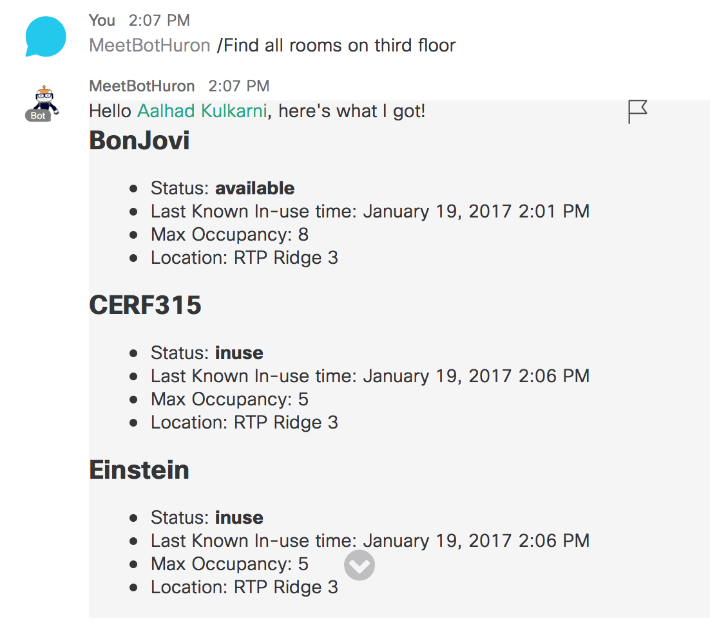

# Cisco Spark Bot examples in nodejs

Interested in creating your own Cisco Spark bots ? 

Go through the examples below.

If you feel inspired, follow the guides to run your own version of these bots: [Guide to run on Cloud9](docs/GuideToRunLocally.md) and [Guide to run locally](docs/GuideToRunOnCloud9.md).  

Or pick a [template](templates/) that suits your scenario, and customize it.

Note that these bot samples code leverage the [node-sparkbot](https://github.com/CiscoDevNet/node-sparkbot) Bot framework.

__and if you're new to Cisco Spark Apps, note that DevNet provides 10 to 20' [Learning labs](https://learninglabs.cisco.com/labs).__

## [helloworld](examples/helloworld.js)

A simple template to start from.

Features illustrated by this example:
- Welcome message as the bot is added in a room
- Help command to display available commands
- Fallback message if a command is not recognized
- **Markdown formatting with mention**
- Leverages the "node-sparkclient" library to wrap calls to the Cisco Spark REST API

This bot can be run as is with either a Developer or a Bot access token 

## [meetbot](examples/meetbot.js)

Template for a meetbot on cisco spark

Features illustrated by this example:
- Welcome message as the bot is added in a room
- Help command to display available commands
- Fallback message if a command is not recognized
- **Markdown formatting with mention**
- Leverages the "node-sparkclient" library to wrap calls to the Cisco Spark REST API

The bot can help you find empty meeting rooms in your building! 
Here are some commands that you can use! 

	•	/RoomStatus {roomname} 
	•	/Find {status} rooms on {floor-specifier} 
	  •	Status
	    •	available, open, empty, free
	    •	inuse, occupied, taken, unavailable, busy
	    •	any, all 
	  •	Floor Specifiers
	    •	first floor 
	    •	1st floor 
	    •	floor 1 
	    •	floor one 
     
     Note: Unfortunately building specifiers are not yet ready! Examples :
	•	/RoomStatus 
	•	/Roomstatus CERF315 
	•	/Find available rooms on the 1st floor 
	•	/find any rooms on floor 3 
	•	/Find all occupied rooms on the floor two
	•	/find available rooms on the second floor 
	
	The bot encourages you to try all kinds of possibilities and let us know your result!

